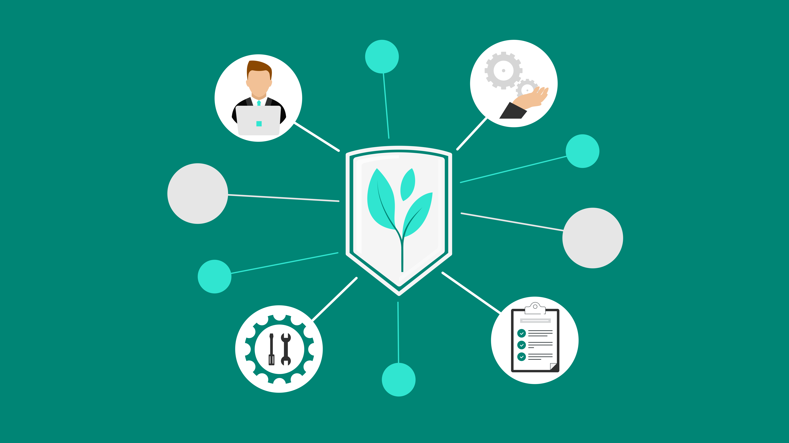

# Pandora.Apache.Avro.IDL.To.Apache.Parquet

Currently, when working with [Apache Kafka®][apache-kafka] and [Azure
Databricks®][azure-databricks] ([Apache Spark®][apache-spark]), there is a
built-in mechanism to transform [Apache Avro®][apache-avro] data to [Apache
Parquet®][apache-parquet] files. The issue with this approach, if we think in
[medallion lakehouse architecture][medallion-lakehouse-architecture], is that
`AVRO` with nested data, will be persisted in a single `PARQUET` file in the
[bronze layer (full, raw and unprocessed history of each
dataset)][medallion-lakehouse-architecture-bronze] relying on `ArrayType`,
`MapType` and `StructType` to represent the nested data. This will make it a bit
more tedious to post-process data respectively in the following layers: [silver
(validated and deduplicated data)][medallion-lakehouse-architecture-silver] and
[gold (data as knowledge)][medallion-lakehouse-architecture-gold].

|  | 
|:--:| 
| Figure 1: [Delta lake medallion architecture and data mesh][medallion-lakehouse-architecture-data-mesh] |

To avoid this issue, we present an **open-source library**, that will help
transform `AVRO`, with nested data, to multiple `PARQUET` files where each of
the nested data elements will be represented as an extension table (separate
file). This will allow to merge both the **bronze** and **silver** layers, to
make it easier for data engineers/scientists and business analysts to combine
data with already known logic (`SQL joins`).

|  | 
|:--:| 
| Figure 2: Azure Databricks `python` notebook and `SQL` cell |

As two of the **medallion layers** are being combined to a single, it might lead
to the possible saving of a ⅓ in disk usage. Furthermore, since we aren't
relying on a naive approach, when flattening and storing data, it could further
lead to greater savings and a more sustainable and environmentally friendly
approach.

|  | 
|:--:| 
| Figure 3: [Green Software Foundation][green-software-foundation] with the Linux Foundation to put sustainability at the core of software engineering |

[apache-kafka]:                               https://kafka.apache.org/
[azure-databricks]:                           https://azure.microsoft.com/en-us/products/databricks/
[apache-spark]:                               https://spark.apache.org/
[apache-spark]:                               https://spark.apache.org/
[apache-avro]:                                https://avro.apache.org/
[apache-parquet]:                             https://parquet.apache.org/
[medallion-lakehouse-architecture]:           https://docs.databricks.com/lakehouse/medallion.html
[medallion-lakehouse-architecture-bronze]:    https://docs.databricks.com/lakehouse/medallion.html#ingest-raw-data-to-the-bronze-layer
[medallion-lakehouse-architecture-silver]:    https://docs.databricks.com/lakehouse/medallion.html#validate-and-deduplicate-data-in-the-silver-layer
[medallion-lakehouse-architecture-gold]:      https://docs.databricks.com/lakehouse/medallion.html#power-analytics-with-the-gold-layer
[medallion-lakehouse-architecture-data-mesh]: https://www.databricks.com/glossary/medallion-architecture
[green-software-foundation]:                  https://blogs.microsoft.com/blog/2021/05/25/accenture-github-microsoft-and-thoughtworks-launch-the-green-software-foundation-with-the-linux-foundation-to-put-sustainability-at-the-core-of-software-engineering/
