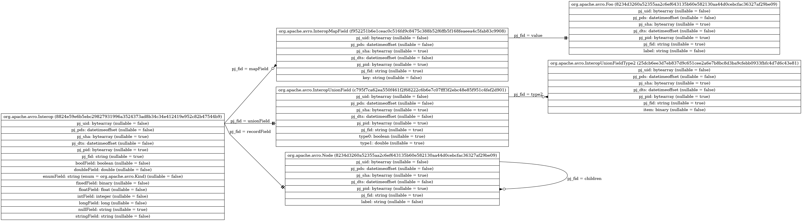

# Pandora.Apache.Avro.IDL.To.Apache.Parquet

## Table of Contents

0. [Background][toc-background]

0. [How to use the library][toc-how-to-use-the-library]

   1. [Package dependencies][toc-package-imports-a2p]
   
   1. [Package imports][toc-package-dependencies-a2p]
   
   1. [Generating random AVRO data][toc-generating-random-avro-data]
   
   1. [Logger and DataLakeServiceClient][toc-logger-and-datalakeserviceclient]
   
   1. [Loop-logic][toc-loop-logic]
   
   1. [Delta-control files (optional)][toc-delta-control-files-optional]
   
   1. [Main method][toc-main-method]

0. [How to contribute][toc-how-to-contribute]

   1. [Package dependencies][toc-package-imports-a2d]
   
   1. [Package imports][toc-package-dependencies-a2d]
   
   1. [Logger][toc-logger]
   
   1. [isNullable and fieldToType][toc-isnullable-and-fieldtotype]
   
   1. [Iterating over local AVSC files][toc-iterating-over-local-avsc-files]

   1. [Generate directed graphs][toc-generate-directed-graphs]

   1. [Generate SVG and PNG files][toc-generate-svg-and-png-files]

0. [Project dependencies][toc-project-dependencies]
   
   1. [Library][toc-avroidl2parquet-lib]
   
   1. [Samples][toc-avroidl2parquet-samples]
   
   1. [Unit Tests][toc-avroidl2parquet-unit-tests]

[toc-background]:                       #background

[toc-how-to-use-the-library]:           #how-to-use-the-library
[toc-package-imports-a2p]:              #package-imports-a2p
[toc-package-dependencies-a2p]:         #package-dependencies-a2p
[toc-generating-random-avro-data]:      #generating-random-avro-data
[toc-logger-and-datalakeserviceclient]: #logger-and-datalakeserviceclient
[toc-loop-logic]:                       #loop-logic
[toc-delta-control-files-optional]:     #delta-control-files-optional
[toc-main-method]:                      #main-method

[toc-how-to-contribute]:                #how-to-contribute
[toc-package-imports-a2d]:              #package-imports-a2d
[toc-package-dependencies-a2d]:         #package-dependencies-a2d
[toc-logger]:                           #logger
[toc-isnullable-and-fieldtotype]:       #isnullable-and-fieldtotype
[toc-iterating-over-local-avsc-files]:  #iterating-over-local-avsc-files
[toc-generate-directed-graphs]:         #generate-directed-graphs
[toc-generate-svg-and-png-files]:       #generate-svg-and-png-files

[toc-project-dependencies]:             #project-dependencies
[toc-avroidl2parquet-lib]:              #library
[toc-avroidl2parquet-samples]:          #samples
[toc-avroidl2parquet-unit-tests]:       #unit-tests

[toc-back-to-toc]: #table-of-contents

## Background

Currently, when working with [Apache Kafka®][apache-kafka] and [Azure
Databricks®][azure-databricks] ([Apache Spark®][apache-spark]), there is a
built-in mechanism to transform [Apache Avro®][apache-avro] data to [Apache
Parquet®][apache-parquet] files. The issue with this approach, if we think in
[medallion lakehouse architecture][medallion-lakehouse-architecture], is that
`AVRO` with nested data, will be persisted in a single `PARQUET` file in the
[bronze layer (full, raw and unprocessed history of each
dataset)][medallion-lakehouse-architecture-bronze] relying on `ArrayType`,
`MapType` and `StructType` to represent the nested data. This will make it a bit
more tedious to post-process data respectively in the following layers: [silver
(validated and deduplicated data)][medallion-lakehouse-architecture-silver] and
[gold (data as knowledge)][medallion-lakehouse-architecture-gold].

|  | 
|:--:| 
| Figure 1: [Delta lake medallion architecture and data mesh][medallion-lakehouse-architecture-data-mesh] |

To avoid this issue, we present an **open-source library**, that will help
transform `AVRO`, with nested data, to multiple `PARQUET` files where each of
the nested data elements will be represented as an extension table (separate
file). This will allow to merge both the **bronze** and **silver** layers
(_full, raw and history of each dataset combined with defined structure,
enforced schemas as well validated and deduplicated data_), to make it easier
for data engineers/scientists and business analysts to combine data with already
known logic (`SQL joins`) and tools.

|  | 
|:--:| 
| Figure 2: Azure Databricks `python` notebook and `SQL` cell |

As two of the **medallion layers** are being combined to a single, it might lead
to the possible **saving of a ⅓ in disk usage**. Furthermore, since we aren't
relying on a naive approach, when flattening and storing data, it could further
lead to **greater savings** and a more **sustainable** and **environmentally
friendly** approach.

|  | 
|:--:| 
| Figure 3: [Green Software Foundation][green-software-foundation] with the Linux Foundation to put sustainability at the core of software engineering |

[Back to TOC][toc-back-to-toc]

[apache-kafka]:                               https://kafka.apache.org/
[azure-databricks]:                           https://azure.microsoft.com/en-us/products/databricks/
[apache-spark]:                               https://spark.apache.org/
[apache-spark]:                               https://spark.apache.org/
[apache-avro]:                                https://avro.apache.org/
[apache-parquet]:                             https://parquet.apache.org/
[medallion-lakehouse-architecture]:           https://docs.databricks.com/lakehouse/medallion.html
[medallion-lakehouse-architecture-bronze]:    https://docs.databricks.com/lakehouse/medallion.html#ingest-raw-data-to-the-bronze-layer
[medallion-lakehouse-architecture-silver]:    https://docs.databricks.com/lakehouse/medallion.html#validate-and-deduplicate-data-in-the-silver-layer
[medallion-lakehouse-architecture-gold]:      https://docs.databricks.com/lakehouse/medallion.html#power-analytics-with-the-gold-layer
[medallion-lakehouse-architecture-data-mesh]: https://www.databricks.com/glossary/medallion-architecture
[green-software-foundation]:                  https://blogs.microsoft.com/blog/2021/05/25/accenture-github-microsoft-and-thoughtworks-launch-the-green-software-foundation-with-the-linux-foundation-to-put-sustainability-at-the-core-of-software-engineering/

## How to use the library

In order to show how to use the library to convert `AVRO` nested data to
`PARQUET` files, we will rely on some succinct demo script snippets. The fully
working script is available at: [./demo/avroidl2parquet.fsx][demo-script-a2p].

[Back to TOC][toc-back-to-toc]

[demo-script-a2p]: ./demo/avroidl2parquet.fsx

### Package dependencies (A2P)

```fsharp
#r "nuget: Azure.Storage.Files.DataLake,              12.12.01"
#r "nuget: Microsoft.Extensions.Logging,               7.00.00"
#r "nuget: Newtonsoft.Json,                           13.00.02"
#r "nuget: Pandora.Apache.Avro.IDL.To.Apache.Parquet,  0.11.21"

// Specify the local Sample DLL file
#I @"../Pandora.Apache.Avro.IDL.To.Apache.Parquet.Samples/bin/Release/net6.0/"
#r @"Pandora.Apache.Avro.IDL.To.Apache.Parquet.Samples.dll"
```

For this demo script, besides our own package, we will need the following
Microsoft packages:

* **Azure.Storage.Files.DataLake**: To deliver the created `PARQUET` and
  `CONTROL` files to the delta-lake.
* **Microsoft.Extensions.Logging**: Our library needs an instance of an
  `ILogger`.
  
Furthermore, we will also need:
* **Newtonsoft.Json**: This package is needed to parse and pass the `AVRO`
  schema to transform it into a `PARQUET` schema.
  
And finally, we will be using a local `dotnet` project, containing some of the
`AVRO IDL` test samples, taken from [Apache AVRO on GitHub][avro-github].

[Back to TOC][toc-back-to-toc]

[avro-github]: https://github.com/apache/avro/tree/master/lang/java/compiler/src/test/idl

### Package imports (A2P)

Once we have added the packages to our script, we can then import the following
`namespaces`:

```fsharp
open Microsoft.Extensions.Logging

open Azure.Storage.Files.DataLake
open Azure.Storage.Files.DataLake.Models

open Newtonsoft.Json
open Newtonsoft.Json.Linq

open Pandora.Apache
open Pandora.Databricks
open Pandora.Utils

open org.apache.avro
open org.apache.avro.test
```

[Back to TOC][toc-back-to-toc]

### Generating random AVRO data

In order to generate random `AVRO IDL` data, we will rely on the following
module, which will serialize the `specific` data-types and deserialize into
`generic` types:

```fsharp
[<RequireQualifiedAccess>]
module Test =
  
  open System.Collections.Generic
  
  let private r = new Random()
  
  // local:
  // - org.apache.avro.Interop
  let private interop () =
    let m = new org.apache.avro.MD5 ()
    m.Value <- Array.init 16 (fun _ -> 0x30uy)
    
    let s = new Node ()
    s.label    <- String.Empty
    s.children <- [| |]
    
    let n = new Node ()
    n.label    <- String.Empty
    n.children <- [| s |]
    
    let f = new Foo ()
    f.label <- "label"
    let d = new Dictionary<string,Foo>()
    d.["foo"] <- f
    
    let i = new Interop ()
    
    i.stringField <- String.Empty
    i.nullField   <- null
    i.mapField    <- d
    i.unionField  <-
      [| 42.0                              :> obj
      ;  [| "bytes is a byte sequence"B |] :> obj
      ;  true                              :> obj
      |][r.Next(0,3)]
    i.enumField   <- Kind.A
    i.fixedField  <- m
    i.recordField <- n
    
    i
    |> Avro.Bytes.Specific.serialize
    |> Avro.Bytes.Generic.deserialize (i.Schema.ToString())
  
  // local:
  // - org.apache.avro.test.TestRecord
  let private testRecord () =
    let m = new org.apache.avro.test.MD5()
    m.Value <- Array.init 16 (fun _ -> 0x30uy)
    
    let t = new TestRecord ()
    
    t.name         <- "name"
    t.kind         <- Kind.BAZ
    t.status       <- Status.A
    t.hash         <- m
    t.nullableHash <-
      [| null
      ;  m
      |][r.Next(0,2)]
    t.value        <- 42.0
    t.average      <- 42.0f
    t.t            <-
      [| Unchecked.defaultof<TimeSpan>
      ;  TimeSpan.Zero
      |][r.Next(0,2)]
    t.l            <- 42L
    t.a            <- [| "string array" |]
    t.prop         <-
      [| null
      ;  "foobar"
      |][r.Next(0,2)]
    
    t
    |> Avro.Bytes.Specific.serialize
    |> Avro.Bytes.Generic.deserialize (t.Schema.ToString())
  
  
  let private cases =
    [| interop
    ;  testRecord
    |]
  
  let randomEvent () =
    let i =
      r.Next
        ( 0
        , Array.length cases
        )
    cases[i] ()
```

[Back to TOC][toc-back-to-toc]

### Logger and DataLakeServiceClient

As our library require to pass an `ILogger` we can easily create one as:

```fsharp
let logger () =
  let lf = new LoggerFactory ()
  lf.CreateLogger ()
```

For the `DataLakeServiceClient` we can create the following value (`dlsc`),
which can then be used in the rest of the script without having to send it as a
function parameter:

```fsharp
let dlsc =
  "AZURE_DATALAKE_ENV_CONN_STR"
  |> Environment.GetEnvironmentVariable
  |> fun connStr ->
    let opts = new DataLakeClientOptions()
    opts.Retry.NetworkTimeout <- TimeSpan.FromMinutes 15 (* In case network is lost *)
    DataLakeServiceClient
      ( connectionString = connStr
      , options          = opts
      )
```

[Back to TOC][toc-back-to-toc]

### Loop-logic

For the recursive and asynchronous `loop` logic, we will pass the created
logger, a cancellation token and the number of data elements to create of a
given `AVRO IDL` instance.

We will then create a `UTC` date and timestamp as well as its representation as
a date-time offset:

```fsharp
let dts = DateTime.UtcNow
let off = new DateTimeOffset(dts)
```

Next step is to define the values for the `environment`, `AST` and `PARQUET`
tables:

```fsharp
let env = Parquet.Schema.Ast.Environment.empty ()
let ast = Parquet.Schema.Ast.empty ()
      
let tabs = Parquet.Tables.empty log ast
```

We create a sequence of `AVRO IDL` test events:

```fsharp
Seq.init n (
  fun _ ->
    Test.randomEvent ()
)
```

and we then transform them to `PARQUET` tables:

```fsharp
…
|> Seq.iteri (
  fun i gen ->
    let idx = i + 1
    let sha =
      gen
      |> Avro.Bytes.Generic.serialize
      |> Hash.SHA256.Bytes.toBytes
    
    let gn  = gen.Schema.Name
    let gns = gen.Schema.Namespace
    
    let fqdn =
      Parquet.Schema.Ast.Fqdn.FQDN
        (      gn
        , Some gns
        )
          
    let (env', ast', es) =
      if not (ast.ContainsKey fqdn) then
        gen.Schema.ToString()
        |> JToken.Parse
        |> Avro.Schema.toParquetSchema log None env ast
      else
        ( env
        , ast
        , Seq.empty
        )
          
    if Seq.isEmpty es then
      let tabs' = Parquet.Tables.update log (Some tabs) ast'
    
      Parquet.Tables.populate
        log
        off
        (Some sha) None None
        ast'
        gen
        gn (Some gns)
        tabs'
      if 0 = idx % m then
        ( Date.timestamp 0
        , sprintf "%032i" i
        )
        ||> sprintf "%s | net.pandora.avroidl2parquet | VERBOSE | DEMO | Generated data items: %s"
        |> Output.stdout
    else
      Date.timestamp 0
      |> printfn "%s | net.pandora.avroidl2parquet | FAILURE | DEMO | Errors:"
      es
      |> Seq.iter (
        fun e ->
          ( Date.timestamp 0
          , e
          )
          ||> sprintf "%s | net.pandora.avroidl2parquet | FAILURE | DEMO | - %s"
          |> Output.stdout
      )
)
```

> **NOTE**: If a given schema is already in the `AST`, we will skip it, as we
> only parsing once a given `AVRO IDL` schema to a `PARQUET` schema.

Once we have generated the `PARQUET` tables, we will transform them to `bytes`
and then store them on the data lake. For this, we will need to define a file
system client:

```fsharp
let fsc =
  "AZURE_DATALAKE_DELTA_BLOB"
  |> Environment.GetEnvironmentVariable
  |> dlsc.GetFileSystemClient
```

Afterwards, we will iterate over the generated tables, which aren't empty,
generate the bytes and then store then in the Azure Tables Storage:

```fsharp
tabs
|> Seq.filter (
  fun table -> 0 < table.Value.Count
)
|> Seq.map (
  fun table ->
    ( table
    , table.Value
      |> Parquet.Tables.toBytes log dts 
    )
)
|> Seq.iter(
  fun (table, parquet) ->
    let ppath =
      Path.Combine
        ( "AZURE_DATALAKE_DELTA_PATH"
          |> Environment.GetEnvironmentVariable
        , table.Key.Replace(".", "/")
        , dts.ToString("yyyy-MM-dd")
          |> sprintf "pj_pds=%s"
        )
          
    (* Submit PARQUET file to Azure Table Storage with enabled Delta Lake *)
    let isppath =
      new DataLakePathClient
        ( fileSystemClient = fsc
        , path             = ppath
        )
      |> fun dlpc ->
        dlpc.ExistsAsync
          ( cancellationToken = ct
          )
        |> Async.AwaitTask
        |> Async.RunSynchronously
  
    if not isppath.Value then
      fsc.CreateDirectoryAsync
        ( path              = ppath
        , cancellationToken = ct
        )
      |> Async.AwaitTask
      |> Async.RunSynchronously
      |> ignore
          
    let pdc =
      ppath
      |> fsc.GetDirectoryClient
  
    let pfc =
      parquet.Key
      |> pdc.GetFileClient
          
    let _ =
            
      use ms = new MemoryStream(parquet.Value)
            
      pfc.UploadAsync
        ( content           = ms
        , overwrite         = false
        , cancellationToken = ct
        )
      |> Async.AwaitTask
      |> Async.RunSynchronously
      |> ignore
          
    ( Date.timestamp 0
    , parquet.Key
    )
    ||> sprintf "%s | net.pandora.avroidl2parquet | VERBOSE | DEMO | Uploaded to the Azure Data Lake: %s"
    |> Output.stdout
)
```

|  | 
|:--:| 
| Figure 4: Parquet folder structure on Azure Table Storage |

[Back to TOC][toc-back-to-toc]

### Delta-control files (optional)

With the code above, we will only add `PARQUET` files to the Azure Table
Storage, but if we want to get the benefits of the delta lake, we will need to
provide a `JSONL` control for each of the uploaded `PARQUET` files. This can be
achieved by modifying the code above like this:

```fsharp
tabs
|> Seq.filter (
  fun table -> 0 < table.Value.Count
)
|> Seq.map (
  fun table ->
    ( table
    , table.Value
      |> Parquet.Tables.toBytes log dts 
    )
)
|> Seq.iter(
  fun (table, parquet) ->
    …
    (* Submit PARQUET file to Azure Table Storage with enabled Delta Lake *)
    …
    ( Date.timestamp 0
    , parquet.Key
    )
    ||> sprintf "%s | net.pandora.avroidl2parquet | VERBOSE | DEMO | Uploaded to the Azure Data Lake: %s"
    |> Output.stdout

    (* Submit CONTROL file to Azure Table Storage `_delta_log` folder *)
    let cpath =
      Path.Combine
        ( "AZURE_DATALAKE_DELTA_PATH"
          |> Environment.GetEnvironmentVariable
        , table.Key.Replace(".", "/")
        , "_delta_log"
        )
          
    let iscpath =
      new DataLakePathClient
        ( fileSystemClient = fsc
        , path             = cpath
        )
      |> fun dlpc ->
        dlpc.ExistsAsync
          ( cancellationToken = ct
          )
        |> Async.AwaitTask
        |> Async.RunSynchronously
  
    if not iscpath.Value then
      fsc.CreateDirectoryAsync
        ( path              = cpath
        , cancellationToken = ct
        )
      |> Async.AwaitTask
      |> Async.RunSynchronously
      |> ignore
          
    control log ct fsc dts parquet schema cpath
)
```

where we ensure that a `_delta_log` folder exists and is populated by our
`control` function which takes: the logger, the cancellation token, the
date-timestamp, the parquet filename & bytes key-value pair, the table schema
and the `_delta_log` folder path.

The first thing we need to do, is to find the next index to be used in the delta
lake. It's mandatory that the naming of the sequence of control files is uniform
with no gaps. Once we have found the next index in the sequence, we will
generate a `JSONL` control file and we will try to upload it. As the Azure Table
Storage relies on [optimistic concurrency][optimistic-concurrency], other
process might have added the next control file in the sequence. Therefore, we
will catch the provided error (`Azure.RequestFailedException` or
`System.AggregateException`) and retry with the next index.

```fsharp
try
  let idx =
    fsc.GetPathsAsync
      ( path              = cpath
      , recursive         = false
      , cancellationToken = ct
      )
    |> fun ps ->
      ps.GetAsyncEnumerator()
      |> Seq.unfold(
        fun it ->
          let next =
            it.MoveNextAsync().AsTask()
            |> Async.AwaitTask
            |> Async.RunSynchronously
          if next then
            let name = it.Current.Name
            let json =
              name
              |> Path.GetExtension
              |> ((=) ".json")
            if not json then
              ( -1
              , it
              )
              |> Some
            else
              ( name
                |> Path.GetFileNameWithoutExtension
                |> int
              , it
              )
              |> Some
          else
            None
      )
      |> Seq.fold max (-1)
      |> ((+) 1)
    
  let jsonl =
    DeltaLake.JSONL.init
      ( log )
      ( dts )
      ( parquet.Value.LongLength )
      ( schema.GetDataFields()
        |> DeltaLake.JSONL.Schema.init log
      )
      ( parquet.Key )
      |> DeltaLake.toBytes log idx cpath
    
  let jdc =
    cpath
    |> fsc.GetDirectoryClient
    
  let jfc =
    jsonl.Key
    |> Path.GetFileName
    |> jdc.GetFileClient
    
  let _ =
            
    use ms = new MemoryStream(jsonl.Value)
            
    jfc.UploadAsync
      ( content           = ms
      , overwrite         = false
      , cancellationToken = ct
      )
    |> Async.AwaitTask
    |> Async.RunSynchronously
    |> ignore
    
  ( Date.timestamp 0
  , jsonl.Key
    |> Path.GetFileName
  )
  ||> sprintf "%s | net.pandora.avroidl2parquet | VERBOSE | DEMO | Uploaded to the Azure Data Lake: %s"
  |> Output.stdout
with
  | :? System.AggregateException
  | :? Azure.RequestFailedException ->
    ( Date.timestamp 0
    , parquet.Key
    )
    ||> sprintf "%s | net.pandora.avroidl2parquet | WARNING | DEMO | Upload retrying Azure Data Lake: %s"
    |> Output.stdout
    control log ct fsc dts parquet schema cpath
  | ex ->
    ( Date.timestamp 0
    , ex
    )
    ||> sprintf "%s | net.pandora.avroidl2parquet | FAILURE | DEMO | Unexpected error:\n%A"
    |> failwith
```

|  | 
|:--:| 
| Figure 5: JSONL control files in _delta_log folder on Azure Table Storage |

[Back to TOC][toc-back-to-toc]

[optimistic-concurrency]: https://azure.microsoft.com/en-us/blog/managing-concurrency-in-microsoft-azure-storage-2/

### Main method

We can now bind the loop to a logic function that will help us to shutdown the
script by pressing `ENTER`

```fsharp
let logic log cts amount =
  [ Async.Control.exit cts
  ; loop log cts.Token amount
  ]
  |> Async.Choice

let _ =
  
  Date.timestamp 0
  |> sprintf "%s | net.pandora.avroidl2parquet | STARTED | DEMO"
  |> Output.stdout
  
  try
    
    let sample =
      fsi.CommandLineArgs
      |> Array.skip 1
      |> fun xs ->
        if 0 < Array.length xs then
          xs.[0]
          |> int
        else
          1
    
    let cts = new CancellationTokenSource()
    let log = logger ()
    
    (* Interrupt script by pressing ENTER *)
    Date.timestamp 0
    |> sprintf "%s | net.pandora.avroidl2parquet | VERBOSE | DEMO | Press ENTER to exit"
    |> Output.stdout
    
    logic log cts sample
    |> Async.RunSynchronously
    |> Option.defaultValue ()
    
    Date.timestamp 0
    |> sprintf "%s | net.pandora.avroidl2parquet | STOPPED | DEMO"
    |> Output.stdout
    
    00
  with ex ->
    ( Date.timestamp 0
    , ex
    )
    ||> sprintf "%s | net.pandora.avroidl2parquet | FAILURE | DEMO | Unexpected error:\n%A"
    |> Output.stdout
    -1
```

As mentioned above, the fully working script is available at:
[./demo/avroidl2parquet.fsx][demo-script-a2p].

[Back to TOC][toc-back-to-toc]

[demo-script-a2p]: ./demo/avroidl2parquet.fsx

## How to contribute

As this library is **open-source**, we would like for others to help us to add
functionality. Therefore, we are providing a sample, where we showcase how by
having access to the [Abstract Syntax Tree (AST)][abstract-syntax-tree], we can
easily create [Entity Relationship (ER)][entity–relationship-diagram] diagrams,
with the [cardinality][cardinality-data-modeling] (numerical) relationship
between rows of one table and rows in another, in the [Graphviz
DOT][graphviz-dot] language. The fully working script is available at:
[./demo/avroidl2dot.fsx][demo-script-a2d].

[Back to TOC][toc-back-to-toc]

[abstract-syntax-tree]:        https://en.wikipedia.org/wiki/Abstract_syntax_tree
[entity–relationship-diagram]: https://en.wikipedia.org/wiki/Entity%E2%80%93relationship_model
[cardinality-data-modeling]:   https://en.wikipedia.org/wiki/Cardinality_(data_modeling)
[graphviz-dot]:                https://graphviz.org/doc/info/lang.html
[demo-script-a2d]:             ./demo/avroidl2dot.fsx

### Package dependencies (A2D)

```fsharp
#r "nuget: Microsoft.Extensions.Logging,              7.00.00"
#r "nuget: Newtonsoft.Json,                          13.00.02"
#r "nuget: Pandora.Apache.Avro.IDL.To.Apache.Parquet, 0.11.26"
```

For this demo script, besides our own package, we will need the following
Microsoft package:

* **Microsoft.Extensions.Logging**: Our library needs an instance of an
  `ILogger`.
  
Furthermore, we will also need:
* **Newtonsoft.Json**: This package is needed to parse and pass the `AVRO`
  schema to transform it into a `PARQUET` schema.

[Back to TOC][toc-back-to-toc]

### Package imports (A2D)

Once we have added the packages to our script, we can then import the following
`namespaces`:

```fsharp
open System
open System.IO
open System.Text

open Microsoft.Extensions.Logging

open Newtonsoft.Json.Linq

open Pandora.Apache
open Pandora.Utils
```

[Back to TOC][toc-back-to-toc]

### Logger

As our library require to pass an `ILogger` we can easily create one as:

```fsharp
let logger () =
  let lf = new LoggerFactory ()
  lf.CreateLogger ()
```

[Back to TOC][toc-back-to-toc]

### isNullable and fieldToType

In order to represent correctly the [ER-diagram cardinality and
ordinality][lucidchart-cardinality-and-ordinality], we will need to use the
following two functions:

```fsharp
let isNullable = function
  | Parquet.Schema.Ast.Type.NULL      ->
    true
  | Parquet.Schema.Ast.Type.UNION fts ->
    ( fts
      |> Seq.exists (
        function
          | Parquet.Schema.Ast.Type.NULL -> true
          | ____________________________ -> false
      )
    ) &&
    ( fts
      |> Seq.filter (
        function
          | Parquet.Schema.Ast.Type.NULL -> false
          | ____________________________ -> true
      )
      |> Seq.length = 1
    )
  | _________________________________ ->
    false

let rec fieldToType = function
  (* # PRIMITIVE TYPES *)
  (* > NOTE: We can't specify `unspecified` as `null` so we rely on an nullable string *)
  | Parquet.Schema.Ast.Type.NULL           -> "string"
  | Parquet.Schema.Ast.Type.BOOLEAN        -> "boolean"
  | Parquet.Schema.Ast.Type.INT            -> "integer"
  | Parquet.Schema.Ast.Type.LONG           -> "long"
  | Parquet.Schema.Ast.Type.FLOAT          -> "float"
  | Parquet.Schema.Ast.Type.DOUBLE         -> "double"
  | Parquet.Schema.Ast.Type.BYTES          -> "binary"
  | Parquet.Schema.Ast.Type.STRING         -> "string"
  (* # LOGICAL TYPES *)
  | Parquet.Schema.Ast.Type.DATE           -> "date"
  | Parquet.Schema.Ast.Type.DECIMAL   _    -> "decimal"
  | Parquet.Schema.Ast.Type.TIMESTAMP_MS   -> "timestamp"
  | Parquet.Schema.Ast.Type.TIME_MS        -> "long"
  (* # COMPLEX TYPES *)
  (* > NOTE: Array and Maps are re-factored to a Record type *)
  | Parquet.Schema.Ast.Type.ARRAY     _
  | Parquet.Schema.Ast.Type.MAP       _    -> String.Empty
  | Parquet.Schema.Ast.Type.UNION     ts   ->
    ts
    |> Seq.filter (
      function
        | Parquet.Schema.Ast.Type.NULL     -> false
        | ____________________________     -> true
    )
    |> Seq.head
    |> fieldToType
  (* # NAMED SCHEMA TYPES *)
  | Parquet.Schema.Ast.Type.ENUM      fqdn ->
    fqdn
    |> Parquet.Schema.Ast.Fqdn.toString 
    |> sprintf "string (enum = %s)"
  (* > NOTE: Errors are Record types *)
  | Parquet.Schema.Ast.Type.ERROR     _    -> String.Empty
  | Parquet.Schema.Ast.Type.FIXED     _    -> "binary"
  (* > NOTE: Record types are filtered out of field types *)
  | Parquet.Schema.Ast.Type.RECORD    _    -> String.Empty
```

|  | 
|:--:| 
| Figure 6: ER-diagram cardinality and ordinality |

[Back to TOC][toc-back-to-toc]

[lucidchart-cardinality-and-ordinality]: https://www.lucidchart.com/pages/ER-diagram-symbols-and-meaning?usecase=erd#section_2

### Iterating over local AVSC files

For this demo sample will be limited to a single `AVRO IDL`, which was converted
to the following `AVSC` [../avro/avsc/Interop.avsc][interop-avsc] file:

```fsharp
Directory.GetFiles
  ( Path.Combine
      ( __SOURCE_DIRECTORY__
      , @"../avro/avsc/"
      )
  // , "*.avsc" // NOTE: Retrieve all AVSC files from the folder
  , @"Interop.avsc"
  , SearchOption.TopDirectoryOnly
  )
|> …
```

> **NOTE**: As you can see from above, it's very easy to iterate over all `AVSC`
> files in the folder.

[Back to TOC][toc-back-to-toc]

[interop-avsc]: ./avro/avsc/Interop.avsc

### Generate Directed Graphs

Firstly, we will define the values for the `environment` and the `AST`:

```fsharp
let env = Parquet.Schema.Ast.Environment.empty ()
let ast = Parquet.Schema.Ast.empty ()
```

We will then read the `AVRO` schema from the file:

```fsharp
let schema = File.ReadAllText f
```

and we will then transform it to a `PARQUET` schema, which if successfully
parsed, will will generate a directed graph:

```fsharp
schema
|> JToken.Parse
|> Avro.Schema.toParquetSchema log None env ast
|> fun (env', ast', es) ->
  if Seq.isEmpty es then
    let _ =
      use fs =
        new FileStream
          ( path =
              Path.Combine
                ( __SOURCE_DIRECTORY__
                , @"dots"
                , Path.GetFileNameWithoutExtension f
                  |> sprintf "%s.dot" 
                )
          , mode = FileMode.OpenOrCreate
          )
      use sw =
        new StreamWriter
          ( stream   = fs
          , encoding = UTF8Encoding false
          )
      sprintf "digraph er {"
      |> sw.WriteLine

      sprintf "  /* Graph */"
      |> sw.WriteLine
      sprintf "  graph[rankdir=RL, overlap=false, splines=polyline]"
      |> sw.WriteLine
      sprintf "  /* Vertices */"
      |> sw.WriteLine
      
      ast'
      |> Seq.sortBy (fun ts -> Parquet.Schema.Ast.Fqdn.``namespace`` ts.Key)
      |> Seq.iter (
        fun ts ->
          let fqdn = Parquet.Schema.Ast.Fqdn.toString ts.Key
          let name = fqdn.Replace('.','_')
          seq {
            yield
              ( sprintf "%s [shape=record, label=\"%s|" name fqdn
              )
            yield
              ( seq {
                  yield "<pj_uid> pj_uid: bytearray (nullable = false)"
                  yield "<pj_pds> pj_pds: datetimeoffset (nullable = false)"
                  yield "<pj_sha> pj_sha: bytearray (nullable = true)"
                  yield "<pj_dts> pj_dts: datetimeoffset (nullable = false)"
                  yield "<pj_pid> pj_pid: bytearray (nullable = true)"
                  yield "<pj_fid> pj_fid: string (nullable = true)"
                  yield!
                    ( ts.Value
                      |> Seq.filter (
                        fun fs ->
                          match fs.Value with
                            | Parquet.Schema.Ast.Type.RECORD _ -> false
                            | ________________________________ -> true
                      )
                      |> Seq.sortBy (fun fs -> fs.Key)
                      |> Seq.map(
                        fun fs ->
                          let uid = fs.Key.Replace('.','_')
                          let typ = fieldToType fs.Value
                          let fid = 
                            fs.Key.Replace('.','/')
                            |> Path.GetFileName
                          let isn = isNullable fs.Value
                          sprintf "<%s> %s: %s (nullable = %b)" uid fid typ isn
                      )
                    )
                }
                |> Seq.reduce (sprintf "%s|%s")
              )
            yield
              ( sprintf "\"]"
              )
          }
          |> Seq.fold ((+)) String.Empty
          |> sprintf "  %s"
          |> sw.WriteLine
      )
        
      sprintf "  /* Edges */"
      |> sw.WriteLine
        
      ast'
      |> Seq.sortBy (fun ts -> Parquet.Schema.Ast.Fqdn.``namespace`` ts.Key)
      |> Seq.iter (
        fun ts ->
          let fqdn = Parquet.Schema.Ast.Fqdn.toString ts.Key
          let name = fqdn.Replace('.','_')
          seq {
            yield!
              ( ts.Value
                |> Seq.map (
                  fun fs ->
                    match fs.Value with
                      | Parquet.Schema.Ast.Type.RECORD (fqdn', otrans) ->
                        Some
                          ( fs.Key
                          , fqdn'
                          , otrans
                          , isNullable fs.Value
                          )
                      | ______________________________________________ ->
                        None
                )
                |> Seq.choose id
                |> Seq.sortBy (fun (key,_,_,_) -> key)
                |> Seq.map(
                  fun (key, fqdn', otrans, nullable) ->
                    let both = "dir=both"
                    let head = "arrowhead=none"
                    let fqdn'' = Parquet.Schema.Ast.Fqdn.toString fqdn'
                    let name'   = fqdn''.Replace('.','_')
                    let card =
                      match otrans with
                        | Some trans ->
                          match trans with
                            | Parquet.Schema.Ast.Type.Transformation.NULLABLE -> "noneteeodot"
                            | Parquet.Schema.Ast.Type.Transformation.ARRAY
                            | Parquet.Schema.Ast.Type.Transformation.MAP      -> "invodot"
                            | Parquet.Schema.Ast.Type.Transformation.UNION  _ ->
                              if nullable then
                                "noneteeodot"
                              else
                                "noneteetee"
                        | None       ->
                          if nullable then
                            "noneteeodot"
                          else
                            "noneteetee"
                    key.Replace('.','/')
                    |> Path.GetFileName
                    |> sprintf "%s:pj_pid -> %s:pj_uid [ %s, %s, arrowtail=%s, label=\"pj_fid = %s\" ];"
                        name' name
                        head both
                        card
                )
              )
          }
          |> Seq.fold (sprintf "%s\n  %s") String.Empty
          |> fun cs ->
            if String.IsNullOrEmpty cs then
              ()
            else
              cs
              |> sprintf "  %s"
              |> sw.WriteLine
      )
        
      sprintf "}"
      |> sw.WriteLine
              
      sw.Flush()
      fs.Flush()
      sw.Close()
      fs.Close()
              
    ( Date.timestamp                   0
    , Path.GetFileNameWithoutExtension f
    )
    ||> sprintf "%s | net.pandora.avroidl2dot | VERBOSE | DOTS | Created the ER-diagram for: %s"
    |> Output.stdout
  else
    es
    |> Seq.iter (
      fun e ->
        ( Date.timestamp 0
        , e
        )
        ||> sprintf "%s | net.pandora.avroidl2dot | FAILURE | DOTS | Unexpected error:\n- %s"
        |> Output.stdout
    )
```

> **NOTE**: Generated syntax is bound to the `Graphviz DOT` language.

As mentioned above, the fully working script is available at:
[./demo/avroidl2dot.fsx][demo-script-a2d].

[Back to TOC][toc-back-to-toc]

[demo-script-a2d]: ./demo/avroidl2dot.fsx

### Generate SVG and PNG files

Once the `DOT` files have been generated, then with the `Graphviz` tool, we can
run the following `bash` script and generate (+vector) image files:

```bash
echo '# Generate SVG and PNG files from DOT files'
for f in $(find $dots -name "*.dot")
do
    echo "Generating SVG from $f"
    dot -T svg $f > $f.svg
    echo "Generating PNG from $f"
    dot -T png $f > $f.png
done
echo
```

|  | 
|:--:| 
| Figure 7: Interop (AVRO IDL) ER-diagram with cardinality and ordinality|

The fully working `bash` script is available at:
[./demo/avroidl2dot.bash][demo-script-bash-a2d].

[Back to TOC][toc-back-to-toc]

[demo-script-bash-a2d]: ./demo/avroidl2dot.bash

## Project dependencies

[Back to TOC][toc-back-to-toc]

### Library

| Dependency | Author | License |
|---| ---| --- |
| FSharp.Core                                 | Microsoft                      | [MIT License](https://github.com/dotnet/fsharp/blob/main/License.txt)
| Apache.Avro                                 | The Apache Software Foundation | [Apache License 2.0](https://github.com/apache/avro/blob/master/LICENSE.txt)
| Newtonsoft.Json                             | James Newton-King              | [MIT License](https://github.com/JamesNK/Newtonsoft.Json/blob/master/LICENSE.md)
| Parquet.Net                                 | Ivan G                         | [MIT License](https://github.com/aloneguid/parquet-dotnet/blob/master/LICENSE)

[Back to TOC][toc-back-to-toc]

### Samples

| Dependency | Author | License |
|---| ---| --- |
| Apache.Avro                                 | The Apache Software Foundation | [Apache License 2.0](https://github.com/apache/avro/blob/master/LICENSE.txt)

[Back to TOC][toc-back-to-toc]

### Unit Tests

| Dependency | Author | License |
|---| ---| --- |
| Microsoft.NET.Test.Sdk                      | Microsoft         | [MIT License](https://github.com/microsoft/vstest/blob/main/LICENSE)
| coverlet.collector                          | .NET foundation   | [MIT License](https://github.com/coverlet-coverage/coverlet/blob/master/LICENSE)
| xunit                                       | .NET foundation   | [Apache License 2.0](https://github.com/xunit/xunit/blob/main/LICENSE)
| xunit.runner.visualstudio                   | .NET foundation   | [Apache License 2.0](https://github.com/xunit/visualstudio.xunit/blob/main/License.txt)

[Back to TOC][toc-back-to-toc]
